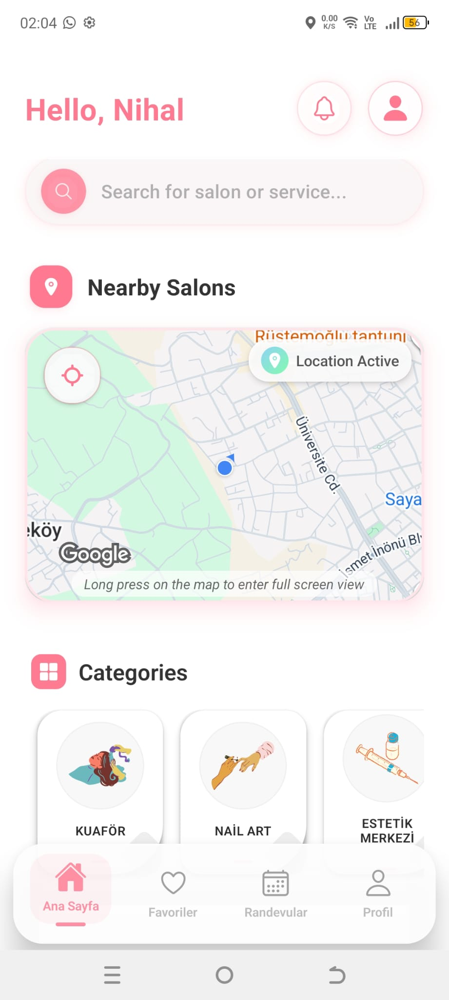
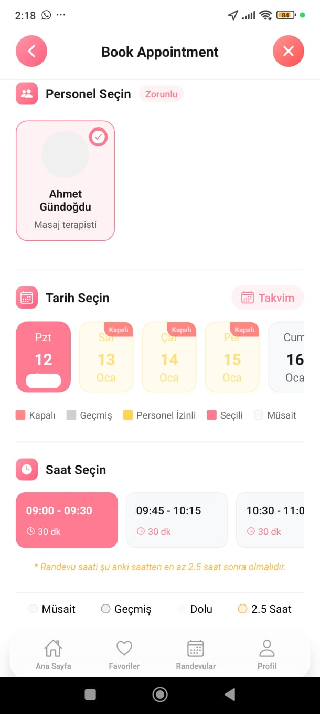
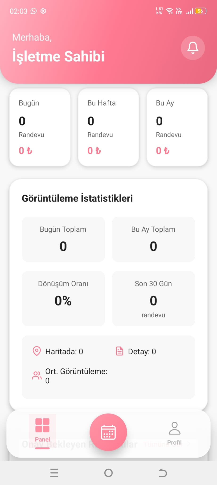

# LookBubble - Beauty & Wellness Marketplace Ecosystem


> **COMMERCIAL PRODUCT DISCLAIMER**  
> *This is a commercial product developed under Vectorium Technology. The source code is private and proprietary due to NDA restrictions. The information below provides a technical overview of the architecture, technology stack, and engineering capabilities solely for portfolio demonstration purposes.*

---

## Project Overview

**LookBubble** is a comprehensive **Service Marketplace** (similar to acts like "Treatwell" or "Armut") connecting beauty professionals with clients in real-time. It features a sophisticated **Dual-Role Architecture**, allowing a single application codebase to serve two distinct user modes:
1.  **Client Mode:** For browsing salons, checking availability, and booking appointments.
2.  **Professional Mode:** For managing schedules, tracking revenue, and showcasing portfolios.

The platform relies on a robust **micro-service ready backend** handling geospatial queries, complex scheduling conflicts, and secure payments.

---

## Technology Stack

This project utilizes a modern, scalable full-stack architecture designed for performance and rapid iteration.

| Category | Frontend (Mobile App) | Backend (API & Logic) |
| :--- | :--- | :--- |
| **Core** | **React Native** (0.76), **Expo** (Managed) | **Django** (5.2), **Python** (3.10+) |
| **Language** | JavaScript (ES6+), React Hooks | Python |
| **API Architecture** | RESTful (Axios), Optimistic Updates | **Django REST Framework (DRF)** |
| **State Management** | React Context API, Async Storage | - |
| **UI & UX** | `react-native-paper`, `animated`, `expo-blur` (Glassmorphism) | - |
| **Maps & Geo** | `react-native-maps`, `expo-location` | GeoDjango (PostGIS/Spatial MySQL) |
| **Auth & Security** | JWT (Access/Refresh Tokens), Biometrics | `simplejwt`, `django-allauth` |
| **Payments** | RevenueCat (Subscriptions), Iyzico | Iyzico Python SDK |
| **Async Tasks** | - | **Celery** + **Redis** (Notifications/Emails) |
| **Infrastructure** | Expo EAS | **Docker**, **Gunicorn**, Nginx |

---

## Key Features

### 1. Advanced Marketplace Logic
*   **Dynamic Service Listing:** Businesses can customize service duration, pricing, and dynamic buffers (cleaning time).
*   **Smart Scheduling:** The backend algorithm calculates available time slots by subtracting existing appointments and "blackout" periods from working hours.

### 2. Geolocation & Discovery
*   **Proximity Search:** Users can find salons sorted by distance (using Haversine formula or Spatial DB queries).
*   **Interactive Maps:** Visual exploration of nearby providers with clustering.

### 3. Integrated Booking Engine
*   **Conflict Resolution:** Atomic database transactions ensure no double-bookings occur during high-traffic periods.
*   **Calendar Sync:** Optimized views for professionals to manage their day/week/month.

### 4. Dual-Role Architecture
*   **Role Switching:** Secure logic allows a user to "Upgrade" to a provider account without determining a new login.
*   **Context-Aware UI:** The app completely transforms its navigation stack and theme based on the active profile (Client vs. Business).

---

## Engineering Highlights

### App-Backend Communication
The app uses a unified `ApiService` abstraction to handle all REST interactions. It includes:
*   **Automatic Token Refresh:** Interceptors catch `401 Unauthorized` errors to seamlessly refresh JWTs without logging the user out.
*   **Standardized Error Handling:** Maps backend validation errors (JSON) directly to UI form fields.

### Glassmorphism & Micro-Interactions
The UI implements modern design trends using `expo-blur` and `Animated` API:
*   **Custom Tab Bar:** A floating, glass-effect navigation bar that adapts to scroll direction.
*   **Smooth Haptics:** `expo-haptics` provide tactile feedback for booking confirmations and slot selection.

---

## Engineering Sample: Booking Availability Logic

The following snippet demonstrates the core logic (simplified) for validating a booking request on the server. It handles conflict detection using Django's `Q` objects and atomic transactions.


```python
from django.db import transaction
from django.utils import timezone
from rest_framework import serializers, status
from rest_framework.response import Response
from .models import Appointment, Service

class AppointmentCreateSerializer(serializers.ModelSerializer):
    class Meta:
        model = Appointment
        fields = ['business', 'service', 'start_time', 'client_note']

    def validate(self, data):
        business = data['business']
        start_time = data['start_time']
        service_duration = data['service'].duration_minutes
        
        end_time = start_time + timezone.timedelta(minutes=service_duration)

        if not business.is_open(start_time):
             raise serializers.ValidationError("Business is closed at this time.")

        overlapping = Appointment.objects.filter(
            business=business,
            status__in=['confirmed', 'pending'],
            start_time__lt=end_time,
            end_time__gt=start_time
        )

        if overlapping.exists():
            raise serializers.ValidationError("This time slot is no longer available.")

        data['end_time'] = end_time
        return data

    def create(self, validated_data):
        with transaction.atomic():
            appointment = Appointment.objects.create(**validated_data)
            send_booking_confirmation.delay(appointment.id)
            return appointment
```

---

## Interface Gallery

| Client Discovery | Booking Flow | Provider Dashboard |
| :---: | :---: | :---: |
|  |  |  |
| *Geolocation & Search* | *Slot Selection & Payment* | *Analytics & Schedule* |
